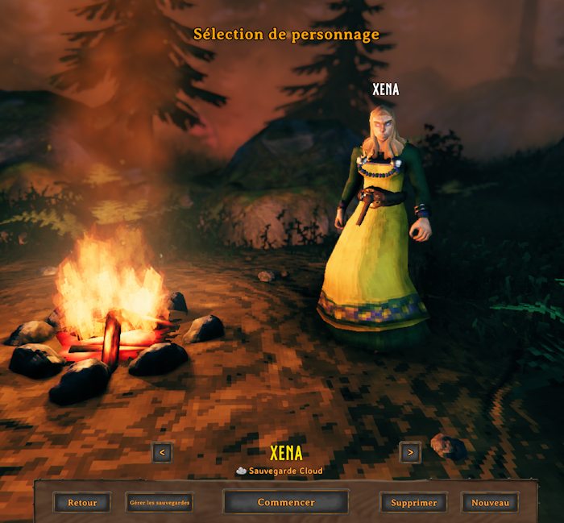

# Harmony Validator

Harmony Validator checks [Harmony](https://harmony.pardeike.net/) patch targets
during a .NET build. It reads assembly metadata without loading the game or
applying patches. The build fails if a targeted method no longer exists or if
the patch parameters are incorrect.

## Requirements

- A .NET SDK with MSBuild
- The framework and references required by the mod
- An assembly that uses Harmony

## Valheim Mod Example

This example adds the selected character name above its head in the Valheim
character selection menu.



The complete example is in [`examples/MyTestMod`](examples/MyTestMod/). It uses
.NET Framework 4.8 with BepInEx and Valheim assemblies.

```text
HarmonyValidator/
  HarmonyValidator.targets
  HarmonyValidator.dll
examples/
  MyTestMod/
    MyTestMod.csproj
    MyTestModPlugin.cs
    CharacterNameLabel.cs
    SetupCharacterPreviewPatch.cs
    UpdateCameraPatch.cs
```

### 1. Install the validator

Extract the release ZIP into your mod repository. Keep
`HarmonyValidator.dll` and `HarmonyValidator.targets` together, for example:

```text
MyMod/
  lib/
    HarmonyValidator/
      HarmonyValidator.dll
      HarmonyValidator.targets
  MyMod.csproj
```

Add the validator path and import to the mod's `.csproj` file:

```xml
<PropertyGroup>
  <HarmonyValidatorPath>$(MSBuildThisFileDirectory)lib\HarmonyValidator</HarmonyValidatorPath>
</PropertyGroup>

<Import Project="$(HarmonyValidatorPath)\HarmonyValidator.targets" />
```

The targets file automatically loads `HarmonyValidator.dll` from the same
directory. It runs the validator after compilation; no command-line invocation
or additional dependency is required.

The example expects these MSBuild properties:

| Property | Value |
| --- | --- |
| `BepInExPath` | BepInEx directory containing `core` |
| `ValheimGamePath` | Valheim installation directory |

### 2. Load the patches

[`MyTestModPlugin.cs`](examples/MyTestMod/MyTestModPlugin.cs) creates the log,
finds the plugin assembly and applies every patch in it:

```csharp
public static ManualLogSource logger =
    BepInEx.Logging.Logger.CreateLogSource(PluginName);

public void Awake()
{
    logger.LogInfo($"{PluginName} {PluginVersion} loaded.");
    Assembly assembly = Assembly.GetExecutingAssembly();
    HarmonyInstance.PatchAll(assembly);
}
```

### 3. Patch a private method

[`CharacterNameLabel.cs`](examples/MyTestMod/CharacterNameLabel.cs) displays the
selected character name above its head. The two Harmony patches each have their
own file and target a private method:

- [`SetupCharacterPreviewPatch.cs`](examples/MyTestMod/SetupCharacterPreviewPatch.cs)
- [`UpdateCameraPatch.cs`](examples/MyTestMod/UpdateCameraPatch.cs)

```csharp
using TMPro;
using UnityEngine;

[HarmonyPatch(
    typeof(FejdStartup),
    "SetupCharacterPreview",
    new[] { typeof(PlayerProfile) })]
internal static class SetupCharacterPreviewPatch
{
    [HarmonyPostfix]
    private static void Postfix(
        FejdStartup __instance,
        PlayerProfile? profile)
    {
        CharacterNameLabel.Create(__instance, profile);
    }
}

[HarmonyPatch(
    typeof(FejdStartup),
    "UpdateCamera",
    new[] { typeof(float) })]
internal static class UpdateCameraPatch
{
    [HarmonyPostfix]
    private static void Postfix(FejdStartup __instance, float dt)
    {
        CharacterNameLabel.Update(__instance);
    }
}
```

### 4. Build the mod

```bat
dotnet build MyMod.csproj -p:BepInExPath="path\to\BepInEx" -p:ValheimGamePath="path\to\Valheim"
```

The validator runs after compilation and before the final DLL is copied:

```text
Harmony targets: 2 checked, 0 errors, 0 unverified.
```

If `UpdateCamera(float)` is incorrectly declared with `string` and `float`, the
build fails:

```text
error SHV002: Target not found: FejdStartup.UpdateCamera
```

Harmony Validator targets .NET Standard 2.0 and runs inside MSBuild. Mono.Cecil
is merged into `HarmonyValidator.dll`, so only the DLL and targets file are
required on Windows and Linux.

## License

MIT
